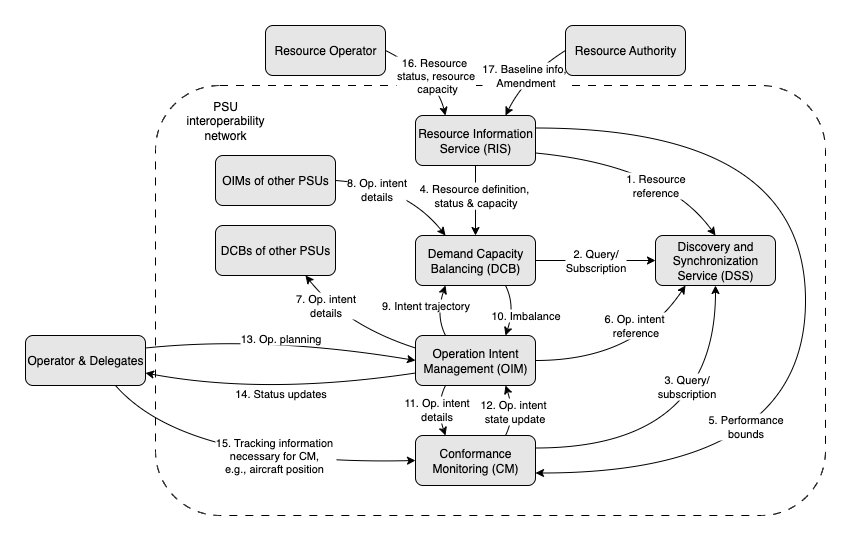

## Overview

The [Advanced Air Mobility National Campaign (NC)-1](https://www.nasa.gov/directorates/armd/advanced-air-mobility-national-campaign-partners/#hds-sidebar-nav-3) for Urban Air Mobility (UAM) Strategic Conflict Management (SCM) simulations, dubbed “X4”, were conducted between July 2021 and June 2022 by NASA with the FAA and industry to investigate what the Provider of Services for UAM (PSU) will need to ensure initial UAM operations can scale in the National Airspace System (NAS).

To continue evolving strategic conflict management capabilities for cooperative Midterm operations, NASA Air Traffic Management eXploration (ATM-X) UAM Airspace Sub-project developed & updated Application Programming Interfaces (APIs) and conducted internal simulations, dubbed "X5, during 2023 - 2024 with NASA-developed prototypes to support Demand-Capacity Balancing and Sequencing & Spacing capabilities for UAM operations.

These APIs were updated again during 2024 - 2025 for Strategic Deconfliction Simulations (SDS) with an industry partner to investigate [ASTM PSU Interoperability Working Group](https://www.astm.org/membership-participation/technical-committees/workitems/workitem-wk85415)'s recommendations focused on strategic aspects of UAM operations, including strategic conflict management through Demand Capacity Balancing (DCB), conformance of operations to their operational intents and compliance of those operational intents for DCB requirements.

The set of APIs referenced in this documentation were tested and validated using the NASA-developed PSU prototypes with industry partners so they may be used to inform future industry standards development and concept validation activities.

## Scope

The APIs were updated from NASA's “UAM X5” version of APIs that was then shared and tested with an industry airspace partner during Strategic Deconfliction Simulations (SDS) activity.

Below diagram shows ASTM Architecture and Information Flow, as of 2025-08-07, for which these APIs were developed for.

  
Figure 1. ASTM Architecture and Information Flow as of 2025-08-07

## API Functional Descriptions

NOTE: There are different Resource Planning Services (RPS) for Demand-Capacity Balancing versus Sequencing and Spacing.

- **FAA-Industry Data Exchange Protocol (FIDXP)** - Provides a gateway for PSU and FAA to share relevant operational information.
- **Discovery and Synchronization Service (DSS)** - Enables third-party services to discover relevant information and ensures that data shared among them are synchronized.
- **Resource Registry (RR)** - Provides connectivity information for third-party resource management services (Demand-Capacity Balancing, Sequencing and Spacing) that PSUs would communicate with.
- **Authentication & Authorization (FIMS-AZ)** - Authenticates and authorizes PSUs and other third-party services.
- **Aeronautical Information (ASDS)** - Provides airspace definitions for UAM, these definitions include vertiport, routes, corridors, arrival and departure procedures. These definitions are developed to accommodate new types of UAM aircraft and operations into the National Airspace System (NAS).
- **Capacity Information (CIS)** - Provides capacity and constraint information about resources that are shared among PSUs.
- **Resource Information Service (RIS)** - Obtains capacity information at shared resources from CIS and provides each resource capacity information to Demand Capacity Balancing (DCB) services (see below).
- **Resource Planning Service - Demand-Capacity Balancing (RPS-DCB)** - Obtains capacity information at shared resources from RIS and provides availability information for earliest estimated departure and arrival time at resources for UAM Fleet Managers, via the PSU, to perform strategic planning & scheduling.
- **Resource Planning Service - Sequencing and Spacing (RPS-SS)** - Obtains constraint information at shared resources from CIS and provides availability information at resources for UAM Fleet Managers, via the PSU, for spacing and sequencing to perform complementary strategic planning & scheduling.
- **Operation Intent Management (OIM) of Provider of Services for UAM (PSU)** - Manages sharing of relevant operational plan information among other PSUs &  services within PSU interoperability network. Also, acts as an interface for UAM Fleet Managers/Operators to obtain common resources and aeronautical information from other third-party services within PSU interoperability network.
- **UAM Fleet Manager/Operator** – Manages the creation or modification of operational plans that meet the strategic conflict management requirements. Interfaces with the PSU to share and obtain relevant operation plans, resources, and aeronautical information.

## Changes from Previous Versions

### Changes X4 -> X5 Version

Below diagram defines X5 system scope and boundaries of the system for which these APIs were previously defined.

  
Figure 1.1 UAM X4 System Scope and Boundaries

#### Major updates

- A new service, Demand-Capacity Balancing (DCB), provides information for PSU to coordinate operations at vertiports. A new API (rps/rps_dcb_api.yml) defines the information exchange requirements between the service and PSU.
- A new service, Sequencing & Spacing, provides information for PSU to coordinate operations at selected corridor entry and exit points. A new API (rps/rps_ss_api.yml) defines the information exchange requirements between the service and PSU.
- A new file, Registration Registry (RR), provides connectivity information about services (i.e., endpoint) that PSU would communicate with. This file provides an interim method to discover dynamic services until a more appropriate mechanism is identified.

- The Capacity Information Service (CIS) file is updated to include additional information about corridor entry and exit points and associated constraint definitions for Sequencing & Spacing.
- A new service, FAA-Industry Data Exchange Prototype Service (FIDXP), provides an initial connection to FAA systems for PSU. A new API (fidxp/fidxp_api.xml) defines initial information exchange requirements between the FIDXP and PSU.
- The Airspace Authorization (AA) service was no longer used.

- A new API, PSU-Fleet Operator API (psu/uam_operator_api.yml), defines the information exchange between NASA PSU and NASA UAM Operator prototypes. This API is specific to NASA implementation and included only as a reference.

### Changes X5 -> SDS Version

#### Major updates

- Add "Proposed", "Completed" & "Canceled" operation states which required changes to several APIs to follow ASTM standard's Operational Intent State Transitions.

  
Figure 3. Operational Intent States Transition Diagram defined in the ASTM PSU Interoperability standard, as of 2025-08-07

- A new service, Resource Information Service (RIS), provides capacity at resources information to Demand Capacity Balancing (DCB) services. A new API (ris/rps_api.yml) defines the information exchange requirements between this service and DCB. RIS provides:
  - available capacity, within time windows, at resources - vertiports & entry/exit points of airspace corridors.
  - resource operators ability to reduce available capacity at resources from certain start time with/without end time.
  - inform subscribers about reduction to available capacity at resources.
- Update Demand Capacity Balancing (DCB) service API (rps/rps_dcb_api.yml) to:
  - accept updates to available capacity at resources.
  - determine imbalanced operations due to updated available capacity at resources & inform OIMs about their imbalanced operations.
- Update Provider of Services for UAM (PSU) API (psu/psu_api.yml) to receive imbalanced operations due to updated available capacity at resources. Imbalanced operations should be passed to UAM Fleet Managers/Operators for re-planning.